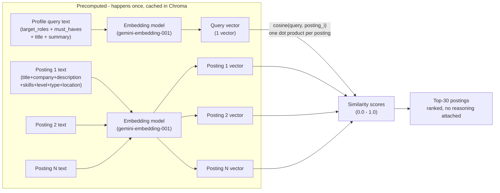
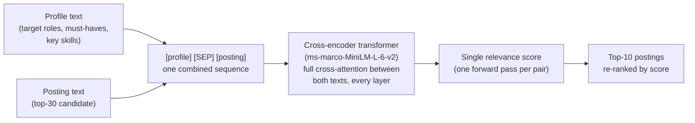

# Cosine Similarity (Phase 2.5) vs. Cross-Encoder (Phase 2.6)

Both stages answer "how relevant is this posting to the profile?" but they sit
at different points in the cascade and compute relevance in structurally
different ways.

## Where each one sits in the cascade

```
50 scraped postings
        │
        ▼
┌───────────────────────┐
│  Phase 2.5 - Cosine    │   bi-encoder, precomputed vectors
│  (services/vector_store│   fast, coarse cut
│   .py: rank_postings_  │
│   by_profile)          │
└───────────┬───────────┘
            │  top 30
            ▼
┌───────────────────────┐
│  Phase 2.6 - Cross-    │   joint transformer pass per pair
│  Encoder (not built    │   slow, precise cut
│  yet - tools/reranker  │
│  .py)                  │
└───────────┬───────────┘
            │  top 10
            ▼
      LLM (Gemini) reasons over the 10, decides + explains
```

## Bi-encoder architecture (cosine similarity)

Profile and posting are embedded **separately**. Neither text is ever seen
by the model at the same time as the other - they only meet afterward, as
two finished vectors compared by geometry.



**Key property: no interaction.** The query vector is computed once and
reused against every posting. Posting vectors are computed once (at
indexing time) and reused across every future query. Comparing a new
profile against 10,000 stored postings is just 10,000 cheap dot products -
no model inference at query time.

## Cross-encoder architecture

Profile text and posting text are concatenated into **one input** and fed
through a single transformer together. Every token can attend to every
other token - including tokens from the *other* text - via self-attention.



**Key property: full interaction, nothing precomputable.** The model can
notice relational mismatches cosine cannot see - e.g. "posting requires 8+
years" vs. "profile shows 4 years" - because both facts sit inside the same
context window during inference. But every pair needs its own full forward
pass; nothing from one comparison can be reused for the next.

## Side-by-side

| | Cosine similarity (bi-encoder) | Cross-encoder |
|---|---|---|
| **Phase** | 2.5 | 2.6 |
| **Inputs to the model** | Profile and posting embedded separately | Profile + posting fed together, one sequence |
| **Interaction between texts** | None - only compared after encoding, via vector geometry | Full - self-attention across both texts, every layer |
| **What's precomputable** | Every posting vector (embed once, reuse forever) | Nothing - one forward pass per (profile, posting) pair, every time |
| **Cost** | O(1) per comparison after embedding (a dot product) | O(n) - a full transformer pass per pair |
| **Granularity compared** | Whole profile-query text vs. whole posting text (1 vector each, no chunking) | Whole profile-query text vs. whole posting text (1 sequence, no chunking) |
| **Can catch constraint mismatches** (e.g. years-of-experience) | No - topical/semantic closeness only | Yes - joint attention sees both facts at once |
| **Where CV chunks (`cv_chunks` collection) are used** | Not used at all | Not used at all - both stages use the curated profile-query text, not the bullet-level highlights (those are for RAG cover-letter drafting, Phase 4.5) |
| **Output** | Similarity score per posting (0.0-1.0) | Relevance score per posting |
| **Role in the pipeline** | Coarse cut: 50 → 30 | Precise cut: 30 → 10 |
| **Ever writes to the sheet / decides a match** | No | No - both are filters only; only the LLM's reasoning (Phase 5) decides and writes `match_reasoning` |
